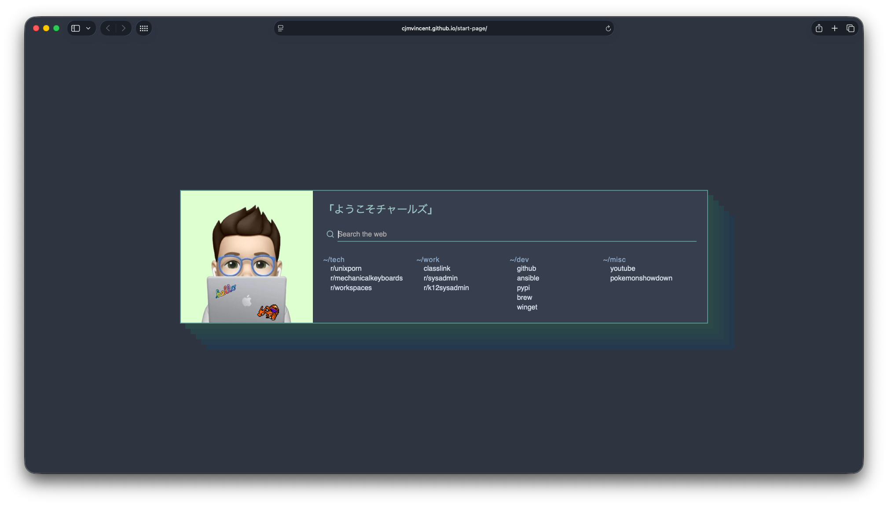

## 🚀 Usage
### 🏡 As Home Page
1. Fork this repo
2. Enable the Github Pages service `Settings → GitHub Pages → Source [master branch] → Save`
3. Set it as Home Page:
   - Click the menu button. and select Options. Preferences.
   - Click the Home panel.
   - Click the menu next to Homepage and new windows and choose to show custom URLs and add your `Github Pages link`